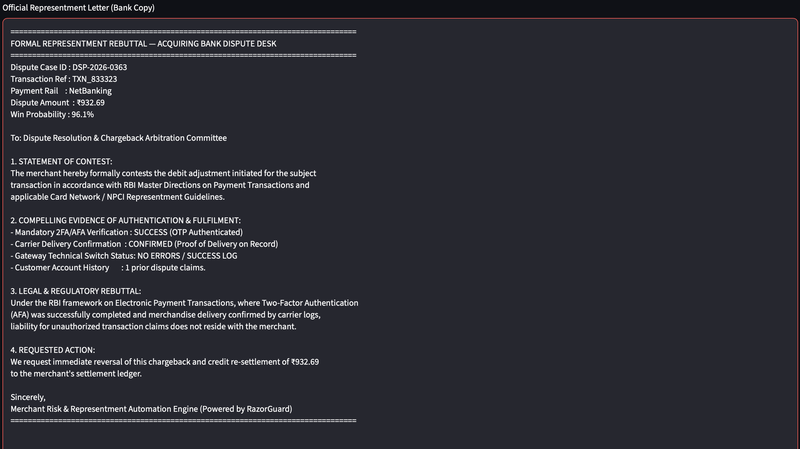

# #  RazorGuard | AI Chargeback Triage Engine

**Razorpay AI Buildathon — Track 02: AI Risk Manager**

[](https://www.python.org/downloads/)](https://img.shields.io/badge/python-3.9+-blue.svg)](https://www.python.org/downloads/))

[](https://streamlit.io)](https://img.shields.io/badge/Streamlit-FF4B4B?logo=streamlit&logoColor=white)](https://streamlit.io))

[](https://scikit-learn.org/)](https://img.shields.io/badge/scikit--learn-%23F7931E.svg?logo=scikit-learn&logoColor=white)](https://scikit-learn.org/))

---

## 🛑 The Core Problem: The Margin-Loss Trap

Indian digital merchants face an operational crisis: **the unit economics of dispute representment are fundamentally broken.**

Manually compiling evidence and submitting a dispute to an acquiring bank costs an estimated **₹500 in human labor and operational overhead per case**. Standard risk models optimize purely for statistical accuracy ($P_{win} > 0.5$). 

This creates two fatal business scenarios:

1. **The Micro-Ticket Trap:** Fighting a ₹300 dispute with a 90% win probability yields an expected recovery of ₹270. Spending ₹500 to recover ₹270 guarantees a net loss of -₹230. 

2. **The High-Ticket Blindspot:** Naive models discard ₹4,000 disputes with a 40% win probability as "likely losses." But structurally, the expected recovery is ₹1,600—yielding a highly profitable net return of +₹1,100.

---

## 💡 The Solution: Economic Expected Value Gating

RazorGuard decouples statistical prediction from the economic decision utilizing a two-stage pipeline:

1. **Machine Learning Classifier:** Evaluates evidence (2FA status, Proof of Delivery, Payment Rail) to predict the strict win probability ($P_{win}$).

2. **Deterministic Financial Engine:** Computes the expected monetary value (EMV).

**The Golden Rule:** Representment is only triggered when `Expected Recovery > ₹500`. If a dispute fails to clear this operational labor threshold, it is automatically conceded to protect merchant margins.

---

## 🛠️ Technical Stack & Architecture

| Component | Technology Used | Purpose |

| :--- | :--- | :--- |

| **Frontend / UI** | Streamlit | Interactive web dashboard for risk analysts |

| **Backend Core** | Python 3 | Core application routing and data logic |

| **Machine Learning** | Scikit-Learn | Training the Random Forest classifier |

| **Data Processing** | Pandas & NumPy | Expected Value (EMV) financial calculations |

| **Visualizations** | Plotly Express | Rendering dynamic feature importance charts |

| **Compliance** | Deterministic JSON | Mapping data to RBI-compliant rebuttal letters safely |

---

## 📊 Dashboard Visuals & Unit Economics

### 1. Actionable Dispute Queue

The system filters incoming disputes and prioritizes them strictly by Expected ROI, discarding margin-burning cases.


### 2. Honest Unit Economics

RazorGuard tracks its own financial performance, actively calculating Wasted Labor Cost (False Positives), Lost Recoverable Revenue (False Negatives), and Total Net Financial Savings.


### 3. Zero-Hallucination Rebuttal Generator 

Open-ended LLMs cannot be safely deployed for banking arbitration due to the severe regulatory risk of hallucinating data. RazorGuard utilizes **Deterministic Template Injection** to map strictly verified database variables directly into an RBI-compliant representment letter.



---

## 🚀 How to Run Locally

1. Clone the repository:

   ```bash

   git clone [[https://github.com/tejistaram/razorguard-chargeback-triage.git](https://github.com/tejistaram/razorguard-chargeback-triage.git)](https://github.com/tejistaram/razorguard-chargeback-triage.git](https://github.com/tejistaram/razorguard-chargeback-triage.git))

   cd razorguard-chargeback-triage

Compared to a baseline policy of disputing all chargebacks blindly, RazorGuard's cost-optimal threshold delivered the following on a 200-case test set:

- **False Positive Labor Waste:** ₹28,500
- **False Negative Lost Revenue:** ₹23,159
- **Net Financial Savings:** ₹6,340.93


## 🚀 How to Run Locally

1. **Clone the repository:**
  ```bash

   git clone [[https://github.com/tejistaram/razorguard-chargeback-triage.git](https://github.com/tejistaram/razorguard-chargeback-triage.git)](https://github.com/tejistaram/razorguard-chargeback-triage.git](https://github.com/tejistaram/razorguard-chargeback-triage.git))

   cd razorguard-chargeback-triage
  ```

